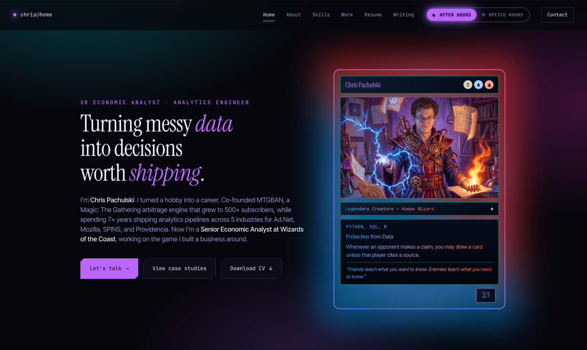

<h1 align="center">chrispachulski.com</h1>

<p align="center">
  <em>Nobody reads the whole page. You get about ninety seconds — so the top of it had better be evidence.</em>
</p>

<p align="center">
  
  
  
  
  
</p>

<p align="center">
  <strong>Two registers &middot; one card &middot; fifty posts</strong><br>
  <sub>A senior economic analyst's portfolio, staged as a grimoire and a git log.</sub>
</p>

---

A hiring manager opens this between two meetings. A consulting prospect opens it one-handed on a phone. A peer opens it because something landed on their feed. All three are answering the same question — *is this person worth a conversation?* — and all three answer it in about ninety seconds, without ever reaching the bottom of the page.

So the argument has to survive in the first screen. The hero is a Magic: The Gathering card with a painted portrait in its art window: name, mana cost, type line, rules text, power and toughness. It's the résumé, written in the format its author spent a career inside. Below it the work history is a git log, the case studies expand in place instead of navigating away, and the writing runs fifty posts deep.

Built by hand. React and CSS, no UI framework, no CSS framework.

<p align="center">
  
</p>

## Features

- **Two registers, one switch.** *After hours* is the dark, neon, Izzet-coloured build (Izzet being Magic's blue-and-red guild of engineers). *Office hours* is cream paper and quiet ink. Not an inverted stylesheet — a genuinely different design, down to which typeface carries the labels.
- **Three-axis theming.** `data-theme`, `data-accent` (five hues), and an opt-in `data-vibe="cyberpunk"` overlay, resolved by an inline script before first paint so the page never flashes the wrong mode.
- **Prerendered, not merely a SPA.** `npm run build` renders every route to static HTML — fifty article pages plus a styled 404, a sitemap, and a hydrated home page — so crawlers and link previews get real markup instead of an empty div.
- **Open Graph cards generated at build.** Fifty per-post share images, composed with Satori and rasterised by resvg, with the fonts bundled rather than borrowed from the host.
- **Motion that waits to be asked.** Thirteen `prefers-reduced-motion` blocks and eighteen `:focus-visible` rules. Ambient motion is deliberately small — a breathing halo on three cards, a slow aurora drift behind the light register, a pulse on the `HEAD` commit — and every piece of it stops dead when the visitor asks it to. Everything else answers a cursor, a click, or a focus ring.
- **A playable aside.** GhostMatch, a small scripted Magic duel you can actually click through, sitting where most portfolios put a testimonial carousel.

## Quick start

```bash
npm install
npm run dev
```

Vite serves it at `localhost:5173`. Node 20 is what the deploy runs on.

```bash
npm run build     # SSR bundle, then prerender every route + OG cards
npm run preview   # serve the built output
npm run lint      # eslint
```

## How it works

Two routes exist: `/` and `/writing/<slug>`. Anything else resolves to home — there is no 404 *route*, only a styled 404 *page* that the prerender writes to disk and Netlify serves for unknown slugs.

The post list is a hand-curated array in `src/lib/catalog.js`; markdown bodies live beside it and load as separate chunks only when an article opens. `npm run build` runs twice on purpose — once to build the SSR entry, once for the client bundle — and then a Node script walks the catalog to emit the static pages and share images.

The three documents that govern the rest are worth reading before changing anything visual:

| Doc | What it owns |
|---|---|
| [`DESIGN.md`](DESIGN.md) | The visual system — palette, type scale, motion rules, the Do/Don't list |
| [`PRODUCT.md`](PRODUCT.md) | Who the site is for, and the anti-references it refuses to become |
| [`ARCHITECTURE.md`](ARCHITECTURE.md) | Module contracts whose behavior you can't guess from their signatures |

<details>
<summary>Notes from the original Vite scaffold</summary>

This project was scaffolded from Vite's React template. Its original README content is preserved below.

This template provides a minimal setup to get React working in Vite with HMR and some ESLint rules.

Currently, two official plugins are available:

- [@vitejs/plugin-react](https://github.com/vitejs/vite-plugin-react/blob/main/packages/plugin-react) uses [Oxc](https://oxc.rs)
- [@vitejs/plugin-react-swc](https://github.com/vitejs/vite-plugin-react/blob/main/packages/plugin-react-swc) uses [SWC](https://swc.rs/)

### React Compiler

The React Compiler is not enabled on this template because of its impact on dev & build performances. To add it, see [this documentation](https://react.dev/learn/react-compiler/installation).

### Expanding the ESLint configuration

If you are developing a production application, we recommend using TypeScript with type-aware lint rules enabled. Check out the [TS template](https://github.com/vitejs/vite/tree/main/packages/create-vite/template-react-ts) for information on how to integrate TypeScript and [`typescript-eslint`](https://typescript-eslint.io) in your project.

</details>
