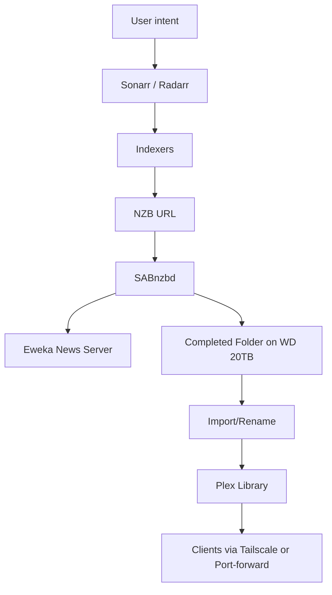

# At Home Media Server


**My setup in plain terms.** I run an iMac 2020 with 64 GB RAM and a WD 20 TB Elements USB 3.0 drive for the library and downloader staging. This is more CPU and memory than the pipeline needs for direct‑play Plex and Usenet automation; it gives headroom for concurrent transcodes and other workloads. The single external drive is simple but not redundant; a ThunderBay enclosure with RAID (or a small NAS) would add fault tolerance and future expansion. I keep this guide general so someone else can replicate the flow on their own hardware.

**What this document is.** A practical, first‑person tutorial that explains the roles (Eweka, SABnzbd, Sonarr, Radarr, indexers, Plex), why they matter, and the exact steps to get from empty disk to a working media server. Replace my hardware choices with yours as needed.

## Glossary (skim first)

* **Usenet**: Global message system where binaries are split into many small articles
* **NZB**: XML list of those article IDs
* **Indexer**: Catalog that turns raw posts into searchable releases
* **Retention**: How long a provider keeps posts
* **Completion**: Percent of parts available to reconstruct a post
* **PAR**: Repair files for missing parts
* **Torznab/Newznab**: API conventions Sonarr/Radarr use to query indexers
* **M3U**: Playlist file or URL that lists channel entries and stream URLs for IPTV apps; used by IPTVX to define the channel lineup
* **XMLTV**: XML‑based Electronic Program Guide format containing channel and schedule metadata; IPTV apps consume it to render a TV guide
* **Shucking**: Removing the bare hard drive from a USB enclosure to use it internally in a NAS/DAS. Often voids warranty and may require 3.3V pin workarounds on some drives

---

## 1) Eweka: What, Why & How

**Lay definition.** Usenet is a global message network where files are posted as many small "articles." An **Usenet access provider** sells you a login to their big server farm that stores those articles. A **news server** is simply that storage and retrieval system. When a downloader requests an NZB, it pulls the listed articles from the provider and reassembles the file.

**Why I use Eweka.** Two things: **performance** and **privacy**. Performance comes from high retention, high completion, many connections, and fast EU backbones. Privacy comes from mandatory TLS so my ISP sees only encrypted traffic to Eweka, not the filenames or groups.

**Practical value.** Fast (and I mean - really, really fast) sustained downloads, fewer failed jobs, and minimal ISP interference.

**Minimal setup steps (SABnzbd → Eweka)**

1. In SABnzbd: Servers → Add server
2. Host: `news.eweka.nl` (or current host). SSL on. Port 563. Connections 12–20
3. Username/Password: from the Eweka account
4. Enable "Retry failed jobs" and PAR2 repair
5. Test server. Save

**Operational checks**

* Watch job history for repair %, failures, and speed. If speeds stall, lower or raise connections until throughput stabilizes

---

## 2) SABnzbd, Sonarr, & Radarr

**What each does**

* **SABnzbd**: The downloader. Takes NZBs, fetches parts from Eweka, repairs, and unpacks
* **Sonarr**: TV automation. Knows shows and episodes. Finds, sends to SABnzbd, imports
* **Radarr**: Movie automation. Same idea for films

**Quick start: SABnzbd**

1. Folders: `incomplete` and `complete` on the WD drive
2. Categories: `tv` → `complete/tv`, `movies` → `complete/movies`
3. Post‑processing: Unpack, Delete after success

**Quick start: Sonarr**

1. Root folder: `/Volumes/Media Empire/tv_shows`
2. Indexers: add Torznab/Newznab feeds (from your indexers) with TV categories
3. Download client: add SABnzbd, category `tv`
4. **Quality profile (my recommendation)**

   * **Modern live‑action**: custom ladder capped between **720p and 1080p** with sensible bitrates; set **cutoff = 1080p WEB‑DL**
   * **Older content (pre‑1990)** and **animated/cartoon**: use the **Any** profile; higher resolutions add size without meaningful gain
   * Rationale: 2160p releases are often **25–70 GB** each; they bloat storage and can bottleneck Apple TV devices and many TVs that cannot display the incremental quality
5. Release profiles: preferred terms and rejects

**Quick start: Radarr**

1. Root folder: `/Volumes/Media Empire/movies`
2. Indexers: movie categories
3. Download client: SABnzbd, category `movies`
4. **Quality profile (my recommendation)** mirrors Sonarr: modern films cap at **1080p** cutoff; classics/animation use **Any**

**Playback practicality**

* Plex has “Optimize” to create smaller transcodes, but that **duplicates** files and increases bloat. I avoid it unless a specific device needs it
* If streaming freezes on Apple TV:

  * **tvOS system level**: Settings → **Video and Audio** → **Format** → set **1080p SDR 60Hz**. Optionally disable **Match Dynamic Range/Frame Rate** to reduce bandwidth and processing demand
  * **Plex during playback**: open the options panel (gear icon) → **Quality** → select **1080p** (or a fixed Mbps like 8–12). You can also set defaults in Plex app Settings → Video → Local/Remote Quality

**Flow**

1. Sonarr/Radarr watch RSS from indexers
2. Match → send NZB to SABnzbd with the right category
3. SABnzbd downloads via Eweka, repairs, unpacks to `complete/`
4. Sonarr/Radarr import, rename, and move into the Plex library on the WD drive

---

## 3) Indexers

**Plain summary.** Indexers are the catalogs. They turn messy Usenet posts into clean entries you can search. Sonarr/Radarr never guess filenames; they ask indexers which exact release matches a show or movie.

**What I get from them**

* A clean title with year/season/episode
* Resolution and codec tags for quality rules
* Links (NZBs) that point to the right articles on Eweka
* Redundancy across multiple catalogs so one outage does not block grabs

**Reality check**

* Indexers are often the **bottleneck**. If a post is not listed or is DMCA‑removed quickly, it will not be found. Multiple indexers mitigate but do not eliminate this
* After a download finishes, expect **2–5 minutes** for repair/unpack → Sonarr/Radarr import → Plex scan. The catalog will not update instantly

**Set up**

* Create accounts on two or more Torznab/Newznab‑compatible indexers
* In Sonarr/Radarr, add each indexer with API key and the correct categories
* Keep API rates conservative to avoid throttling

---

## 4) Storage & Hardware

**My choices**

* External drive: WD 20TB Elements Desktop, USB 3.0
* Host: iMac 2020, 10‑core i9, 64GB RAM, macOS Sequoia

**Why this works**

* USB 3.0 bandwidth and 3.5" HDD sustained speeds are ample for Usenet pulls, imports, and Plex direct‑play
* 20 TB gives room for upgrades and remuxes

**Expansion path I would take**

* Add a ThunderBay enclosure and use RAID for fault tolerance, then migrate the library while keeping the current 20 TB drive for a second project or backup staging. I do not plan to shuck the Elements drive

**Note on shucking**

* Shucking = removing the bare HDD from a USB enclosure to mount inside a NAS/DAS. Pros: lower cost per TB. Cons: warranty risk and possible 3.3V pin issues. I prefer a ThunderBay migration instead

**File system and layout**

* APFS on macOS. Share via SMB if containers or other hosts need access
* Directory plan remains:

```
/Volumes/Media Empire/
  tv_shows/
  movies/
  downloads/
    sabnzbd/
      incomplete/
      complete/
```

---

**File system and layout**

* APFS on macOS. Share via SMB if containers or other hosts need access
* Directory plan remains:

```
/Volumes/Media Empire/
  tv_shows/
  movies/
  downloads/
    sabnzbd/
      incomplete/
      complete/
```

---

## 5) TubeArchivist + YouTube

**Why a YouTube section exists.** I keep a dedicated YouTube lane for long‑form, non‑studio content that does not fit traditional movie/TV pipelines. Treating channels as TV shows yields a cleaner Plex dashboard and predictable episode ordering. Have to make sure we have Ms Rachel and The Wiggles on hand **at all times** or the little one will lose their mind.

**TubeArchivist setup (minimal).**

1. Deploy TubeArchivist (Docker is simplest). Set the **download root** to `$HOME/tubearchivist/media`
2. Subscribe to channels/playlists. Enable periodic sync and downloads
3. Keep output as MP4 for broad client compatibility

**My shell script role (summary).** After TubeArchivist downloads, my script acts as a **local indexer/organizer**:

* Scans `$HOME/tubearchivist/media/<channel_id>/` for videos
* Resolves channel → human‑readable show name, builds `.../youtube/<Show>/Season 01/`
* Sorts by **YouTube upload date** so episodes appear chronologically
* Deletes shorts under a threshold (default 180s) to avoid clutter
* Renames to `Show - S01E## - Title.mp4` with safe filenames and sequential numbering
* Downloads thumbnails and **embeds TV‑show tags** (cover art, season/episode) using AtomicParsley or exiftool
* Moves finished files into the YouTube library folder so Plex imports them like episodes

**Outcome.** Channel feeds become clean, postered TV‑style seasons inside Plex without manual tagging.

---

## 6) Plex Server & Remote Access

**Why Plex gets its own callout**

* Plex turns the organized files into apps and streams. It handles metadata, client profiles, and remote access

**Plex basics**

1. Point libraries to `tv_shows/` and `movies/`
2. Create a **separate TV library** named **YouTube** that points to `/Volumes/Media Empire/youtube`

   * Library agent: set **Local Media Assets (TV)** at the top and disable online agents so Plex trusts embedded tags/posters
   * Advanced: **Flatten TV show seasons = Always** if you prefer no season folders for single‑season channels
3. Enable scheduled scans. Prefer direct‑play. The i9 can transcode if needed

**Remote access options**

* **Tailscale (my preference).** Tailscale is a mesh VPN built on WireGuard. I install it on the iMac and my client devices. I can mark the media server as an **exit node** so devices can route traffic through my home network. Result: I reach Plex securely from anywhere without opening ports.

  * Steps:

    1. Install Tailscale on the iMac and sign in
    2. `tailscale up --advertise-exit-node` (or enable Exit Node in the GUI)
    3. On clients, select that exit node. Verify you can hit the Plex local IP on its Tailscale address
  * Why it works: devices form encrypted tunnels; DNS and traffic optionally egress through the exit node, giving access to services as if local

* **Native Plex Remote Access.** Alternative is port‑forwarding from your router to the Plex port on the iMac. Works, but exposes a service on the public internet. Tailscale avoids inbound ports and double‑NAT issues.

---

## 7) Sports and Live TV

**Why this lane exists.** Plex Live TV is sometimes enough. When I want full control and broader sports/live options, I add **MyBunny.tv** with **IPTVX** on Apple TV. This runs on the same iMac and is independent of the Sonarr/Radarr pipeline.

**Basics.** MyBunny.tv provides an **M3U playlist** (channel list/URLs) and an **XMLTV EPG** (guide data). IPTVX consumes both to render a cable‑style guide and live playback.

**Setup (IPTVX on Apple TV)**

1. Get the **M3U** and **XMLTV** URLs from the MyBunny dashboard. Keep the tokens private
2. IPTVX → **Settings** → **Playlists** → **Add** → **By URL** → paste the **M3U**. Name it (e.g., “MyBunny”)
3. IPTVX → **Settings** → **EPG Sources** → **Add** → paste the **XMLTV** URL. Associate it with the MyBunny playlist
4. Force a refresh if the guide is empty: long‑press the playlist → **Refresh metadata/EPG**. Verify time‑zone and any EPG offset settings
5. Optional: Hide noisy categories, create **Favorites**, and set update intervals (6–12 h) for playlist and EPG

**Playback notes (stability and quality)**

* tvOS: **Settings → Video and Audio** → choose **1080p SDR 60 Hz** if streams stutter; enable **Match Frame Rate**. This avoids 30‑fps caps and reduces processing load
* IPTVX during playback: open the gear/options → set **Quality** to a steady level (e.g., 1080) if auto causes buffering; prefer HLS variants when available

**Integration stance.** MyBunny+IPTVX is **separate** from Plex libraries and does not involve Sonarr/Radarr or indexers. It complements the library by covering live sports and events while Plex covers on‑demand media. Tailscale still applies for secure remote access to the iMac and local network services.

---

## 8) How the Pieces Fit

1. Sonarr/Radarr maintain wanted lists and rules
2. They query indexers and send NZBs to SABnzbd
3. SABnzbd downloads via Eweka, repairs, and unpacks to the WD drive
4. Sonarr/Radarr import and rename into Plex libraries
5. Plex scans and serves to clients locally and over Tailscale or via its remote access



---

## 9) Minimal Settings Checklist

**SABnzbd**

* Server: Eweka host, SSL on, 12–20 connections
* Categories: `tv` → `/downloads/complete/tv`, `movies` → `/downloads/complete/movies`
* Unpack, Repair, Delete after success: enabled

**Sonarr**

* Indexers: 2+ Torznab sources with TV categories only
* Quality profile: set cutoff
* Release profiles: preferred and reject terms
* Root folder: `/Volumes/Media Empire/tv_shows`
* Completed Download Handling: enabled

**Radarr**

* Mirror Sonarr with movies and `/Volumes/Media Empire/movies`

**Plex**

* Libraries target the final folders. Background scanning on

---

## 10) Glossary

* **Usenet**: Global message system where binaries are split into many small articles
* **NZB**: XML list of those article IDs
* **Indexer**: Catalog that turns raw posts into searchable releases
* **Retention**: How long a provider keeps posts
* **Completion**: Percent of parts available to reconstruct a post
* **PAR**: Repair files for missing parts
* **Torznab/Newznab**: API conventions Sonarr/Radarr use to query indexers

---

## 11) Failure & Fast Diagnostics

* Grabbed but failed in SABnzbd: try an alternate release; check completion; verify connections
* Imported to wrong place: fix categories or root‑folder mapping
* Plex not seeing new media: check library paths, permissions, or scanning
* Slow imports: disk near full, Spotlight index churn, or antivirus; exclude `downloads/`

---

## 12) Costs & Final Summary

### Subscriptions and software

- Eweka Top Plan (annualized): EUR 6.99/mo (~$90/yr), Annualized top tier; SSL; 50 connections
- MyBunny.tv: $20.00/mo, Live TV and sports playlist/EPG source
- IPTVX: $2.42/mo ($28.99/yr), Apple TV client for M3U and XMLTV
- SABnzbd: $0, Open source
- Sonarr/Radarr: $0, Open source
- Plex Pass Lifetime: ~$120 one-time, Lifetime license
- Tailscale: $0, Personal tier
- Indexers: $0, Free (paid options $5-$20/mo total)

### Hardware (typical as of 2025)

- WD Elements 20 TB: $250-$330, Street price range
- iMac 27" 2020, i9, 64 GB (current value): $700-$1,200, Used-market estimate; exceeds needs
- Viable server alternative: $250-$700, Used Intel NUC or M1 Mac mini
- ThunderBay enclosure + disks: TBD, Potential future RAID expansion
- UPS: $80-$150, Clean shutdowns


**My Setup**

* iMac 2020 + WD 20 TB Elements
* SABnzbd + Eweka (annualized top tier)
* Sonarr/Radarr with 1080p cap for modern, Any for pre‑1990/animation
* Multiple indexers
* Plex libraries (TV/Movies + separate YouTube), remote via Tailscale exit node
* MyBunny.tv + IPTVX for live sports/TV

---

## 13) Annualized Savings

**Previous stack**

* DirecTV cable: **$129.00/mo** → **$1,548.00/yr**
* Hulu: **$18.99/mo** → **$227.88/yr**
* HBO: **$20.99/mo** → **$251.88/yr**
* Disney+: **$160/yr**
* ESPN+: **$120/yr**
* Netflix: **$216/yr**
* Peacock: **$80/yr**
* Paramount+: **$60/yr**

**Total then**: **$221.98/mo** and **$2,663.76/yr**

**Current stack**

* Eweka Top Plan (annualized): **~$7.50/mo** (**~$90/yr**)
* MyBunny.tv: **$20.00/mo** (**$240/yr**)
* IPTVX: **$2.42/mo** (**$28.99/yr**)

**Total now**: **$29.92/mo** and **$358.99/yr**

**Savings**

* **Monthly**: **$221.98 − $29.92 = $192.06/mo**
* **Annual**: **$2,663.76 − $358.99 = $2,304.77/yr**

**Control benefit**

* I effectively *own* my library’s availability and access: titles do not vanish due to licensing changes, regional blackouts, or app removals. I retain durable local copies and serve them on my terms while paying ~**7.4× less per year** than my prior stack. Ensure your usage complies with local laws and rights management obligations :).

I would probably recommend just setting up a mac mini and forgetting about it.

**TubeArchivist Personal Indexer**

```bash
#!/usr/bin/env bash
# macOS-safe (Bash 3.2). No Plex calls. Orders episodes by YouTube upload_date.
set -uo pipefail
IFS=$'\n\t'; LC_ALL=C

# --- PATHS ---
SRC_ROOT="$HOME/tubearchivist/media"
DEST_ROOT="/Volumes/Media Empire/youtube"

SEASON=1          # fixed season
MIN_SECS=180      # delete clips shorter than this

have() { command -v "$1" >/dev/null 2>&1; }

# ASCII-only, filesystem-safe
safe() {
  local s="$1"
  s="$(printf '%s' "$s" | tr "$(printf '\r\n')" '  ')"
  s="$(printf '%s' "$s" | sed -E 's/[\/:*?"<>|]/-/g')"
  s="$(printf '%s' "$s" | LC_ALL=C tr -cd '[:alnum:][:space:]._+()&,-')"
  printf '%s' "$s" | awk '{$1=$1; print}'
}

is_ytid(){ echo "$1" | grep -Eq '^[A-Za-z0-9_-]{11}$'; }

yt_print(){ yt-dlp --no-warnings -R 8 --sleep-requests 1 --force-ipv4 \
                  --extractor-args "youtube:player_client=android" \
                  --print "$1" "$2" 2>/dev/null || true; }

duration_seconds(){
  local url="$1" file="$2" d="0"
  if have yt-dlp; then
    d="$(yt_print '%(duration)s' "$url")"
    echo "$d" | grep -Eq '^[0-9]+$' || d="0"
  fi
  if [ "$d" = "0" ] && have ffprobe; then
    d="$(ffprobe -v error -show_entries format=duration -of default=nk=1:nw=1 "$file" 2>/dev/null | awk '{printf("%.0f",$1)}')"
    echo "$d" | grep -Eq '^[0-9]+$' || d="0"
  fi
  echo "$d"
}

next_ep(){
  local d="$1" max=0 n
  [ -d "$d" ] || { echo 1; return; }
  find "$d" -maxdepth 1 -type f \( -iname '*.mp4' -o -iname '*.m4v' \) -print0 2>/dev/null \
  | xargs -0 -n1 basename 2>/dev/null \
  | while IFS= read -r b; do
      n="$(echo "$b" | sed -nE 's/.*S[0-9]{2}E([0-9]{2,3}).*/\1/p')"
      [ -z "$n" ] && n="$(echo "$b" | sed -nE 's/.*Episode[[:space:]]+([0-9]{2,3})[[:space:]]-.*/\1/p')"
      [ -n "$n" ] && [ "$n" -gt "$max" ] && max="$n"
      echo "$max"
    done | tail -n1 | { read v || v="0"; echo $(( ${v:-0} + 1 )); }
}

download_thumb(){
  local url="$1" outbase="$2"
  [ -e "${outbase}.jpg" ] && return 0
  yt-dlp --no-warnings --skip-download --write-thumbnail -o "${outbase}.%(ext)s" "$url" >/dev/null 2>&1 || true
  for ext in webp png; do
    if [ -f "${outbase}.${ext}" ] && have ffmpeg; then
      ffmpeg -v error -y -i "${outbase}.${ext}" "${outbase}.jpg" && rm -f "${outbase}.${ext}"
    fi
  done
  [ -f "${outbase}.jpg" ]
}

embed_tags(){
  local file="$1" show="$2" season="$3" ep="$4" title="$5" artbase="$6"
  local art=""
  [ -f "${artbase}.jpg" ] && art="${artbase}.jpg"
  [ -z "$art" ] && [ -f "${artbase}.png" ] && art="${artbase}.png"
  local ep_str; ep_str="$(printf 'S%02dE%02d' "$season" "$ep")"

  if have AtomicParsley; then
    local args=( "$file" --stik "TV Show" --title "$title" --TVShowName "$show"
                 --TVSeason "$season" --TVSeasonNum "$season"
                 --TVEpisode "$ep_str" --TVEpisodeNum "$ep" --tracknum "$ep" --overWrite )
    [ -n "$art" ] && args+=( --artwork "$art" )
    AtomicParsley "${args[@]}" >/dev/null 2>&1 || true
    return
  fi
  if have exiftool; then
    local args=( -overwrite_original -Title="$title" -TVShow="$show"
                 -TVSeason="$season" -TVSeasonNum="$season"
                 -TVEpisode="$ep_str" -TVEpisodeNum="$ep" -TrackNumber="$ep"
                 -ContentType="TV Show" )
    [ -n "$art" ] && args+=( -CoverArt="$art" )
    exiftool "${args[@]}" "$file" >/dev/null 2>&1 || true
  fi
}

resolve_channel_title(){
  local channel_id="$1" sample_id="$2" t=""
  t="$(yt_print '%(channel)s' "https://www.youtube.com/watch?v=$sample_id")"
  [ -z "$t" ] && t="$(yt_print '%(channel)s' "https://www.youtube.com/channel/$channel_id")"
  if [ -z "$t" ] && have curl; then
    t="$(curl -fsSL "https://www.youtube.com/feeds/videos.xml?channel_id=$channel_id" 2>/dev/null \
       | sed -n 's:.*<title>\(.*\)</title>.*:\1:p' | sed -n '2p')"
  fi
  [ -z "$t" ] && t="$channel_id"
  echo "$t"
}

echo "📂 Source: $SRC_ROOT"
echo "📦 Dest  : $DEST_ROOT"
have yt-dlp || { echo "❌ yt-dlp not found"; exit 1; }
mkdir -p "$DEST_ROOT"

season2="$(printf '%02d' "$SEASON")"

for channel_dir in "$SRC_ROOT"/*; do
  [ -d "$channel_dir" ] || continue
  channel_id="$(basename "$channel_dir")"

  sample="$(ls "$channel_dir"/*.mp4 2>/dev/null | head -n 1)"
  [ -n "$sample" ] || { echo "📺 $channel_id — ⚠️ No videos, skipping"; continue; }
  sample_id="$(basename "$sample" .mp4)"
  is_ytid "$sample_id" || { echo "📺 $channel_id — ⚠️ Not YT ID layout, skipping"; continue; }

  chan_title_raw="$(resolve_channel_title "$channel_id" "$sample_id")"
  chan_title="$(echo "$chan_title_raw" | sed 's/ - .*//')"
  show="$(safe "$chan_title")"

  dest_dir="$DEST_ROOT/$show/Season $season2"
  mkdir -p "$dest_dir"

  # Build a temp list: upload_date<TAB>srcfile<TAB>title<TAB>duration<TAB>ytid
  tmp="$(mktemp -t ytsort.XXXXXX)"
  while IFS= read -r -d '' f; do
    vid="$(basename "$f" .mp4)"
    is_ytid "$vid" || continue
    url="https://www.youtube.com/watch?v=$vid"

    title="$(yt_print '%(title)s' "$url")"
    [ -z "$title" ] && continue

    # Get upload date (YYYYMMDD), fallback to file mtime
    up="$(yt_print '%(upload_date)s' "$url")"
    echo "$up" | grep -Eq '^[0-9]{8}$' || up="$(stat -f '%Sm' -t '%Y%m%d' "$f" 2>/dev/null || echo 00000000)"

    secs="$(duration_seconds "$url" "$f")"
    printf '%s\t%s\t%s\t%s\t%s\n' "$up" "$f" "$title" "$secs" "$vid" >> "$tmp"
  done < <(find "$channel_dir" -maxdepth 1 -type f -name '*.mp4' -print0)

  # Nothing to do?
  [ -s "$tmp" ] || { echo "📺 $show — nothing to move"; rm -f "$tmp"; continue; }

  # Start at next available episode in destination
  ep="$(next_ep "$dest_dir")"
  echo "📺 $show  → Season $season2  next=E$(printf '%02d' "$ep")  (sorted by upload date)"

  # Process in chronological order
  LC_ALL=C sort -t $'\t' -k1,1n "$tmp" | \
  while IFS=$'\t' read -r up f title secs vid; do
    # duration filter
    if [ -n "$secs" ] && [ "$secs" -gt 0 ] && [ "$secs" -lt "$MIN_SECS" ]; then
      echo "  🗑️  <${MIN_SECS}s: $(basename "$f")"
      rm -f -- "$f"
      continue
    fi

    pretty_title="$(safe "$title")"
    ep2="$(printf '%02d' "$ep")"
    outfile="$dest_dir/$show - S${season2}E${ep2} - $pretty_title.mp4"

    if [ -e "$outfile" ]; then
      echo "  ⏩ Exists: $(basename "$outfile")"
      rm -f -- "$f" 2>/dev/null || true
      continue
    fi

    echo "  ➡️  Move: $(basename "$f")  →  $(basename "$outfile")"
    mv -- "$f" "$outfile"

    artbase="${outfile%.*}"
    download_thumb "https://www.youtube.com/watch?v=$vid" "$artbase" || true
    embed_tags "$outfile" "$show" "$SEASON" "$ep" "$pretty_title" "$artbase"

    ep=$((ep+1))
  done

  rm -f "$tmp"
done

echo "✅ Done."
```
